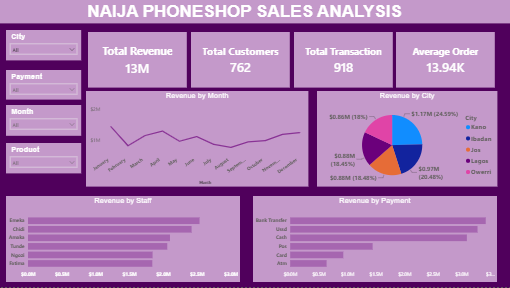
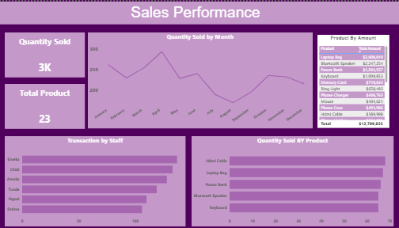

# NaijaPhoneShop Sales Analysis

## Introduction
Retail businesses rely on clear visibility into sales performance to make informed decisions about stock, staffing, and growth. This project analyzes a full year of sales transactions from NaijaPhoneShop, a fictional phone and accessories retailer, to uncover patterns in revenue, customer behavior, staff performance, and product demand, presented through an interactive Power BI dashboard.

## Problem Statement
With sales happening across multiple cities, staff, and payment methods, it can be difficult to see which areas are driving revenue and which products are moving fastest. This project explores the transaction data to answer key questions: which cities and staff generate the most revenue, which payment methods are most used, and which products sell the most, in order to support better business decisions.

## Data Sourcing
The dataset is the NaijaPhoneShop Sales 2024 transaction dataset.

**Key Fields:**
- City
- Product
- Quantity
- Unit price
- Total amount
- Payment method
- Date
- Staff

## Data Transformation & Cleaning
- Used SQL to clean and prepare the raw transaction data before analysis
- Identified and fixed Null and error values in the Quantity, Unit Price, and Total Amount fields
- Standardized inconsistent entries across city, product, and payment method fields

## Analytics and Measures
Built DAX measures and visuals in Power BI, covering:
- Total revenue, total customers, total transactions, and average order value
- Revenue by month and by city
- Revenue by staff member
- Revenue by payment method
- Total quantity sold and total products
- Quantity sold by month and by product

## Dashboard & Visuals
Designed a two-page interactive Power BI report, including:
- KPI cards: Total Revenue, Total Customers, Total Transactions, Average Order, Quantity Sold, Total Product
- Revenue by Month
- Revenue by City
- Revenue by Staff
- Revenue by Payment
- Slicers: City, Payment, Month, Product
- Quantity Sold by Month
- Product by Amount
- Transaction by Staff
- Quantity Sold by Product

## Insight and Findings
- Total revenue for the year reached 13M, across 918 transactions from 762 customers, with an average order value of 13.94K.
- Revenue was fairly spread across cities, with Kano, Ibadan, and Jos among the strongest-performing locations.
- Bank transfer and USSD were the most used payment methods, well ahead of cash, POS, card, and ATM.
- Laptop Bag was the top revenue-generating product at $2,988,879, followed by Bluetooth Speaker ($2,247,251) and Power Bank ($1,594,327).
- Lower-priced accessories like Phone Case, Mouse, and Hdmi Cable generated the least revenue individually, despite steady sales volume.
- Total product revenue across all items reached $12,799,855 for the period analyzed.
- Staff performance varied notably, with a small group of staff members driving a disproportionate share of both revenue and transaction volume.

## Recommendations
- Focus marketing and stock efforts on top-performing cities and products to maximize revenue.
- Encourage wider use of digital payment methods (bank transfer, USSD) given their popularity.
- Review staff performance data to identify training or support opportunities for lower-performing staff.

## Conclusion
This analysis shows how transaction-level sales data can be transformed into clear, actionable insights on revenue drivers, customer behavior, and product performance, supporting smarter business decisions for NaijaPhoneShop.
